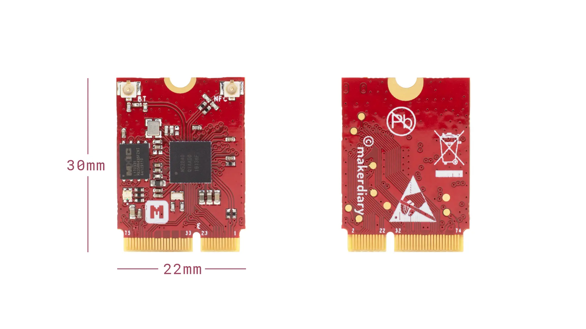

# nRF52840 M.2 Module

> A removable M.2 module that enables multiprotocol connectivity, security and ease-of-use for your next embedded design

## Description

**[nRF52840 M.2 Module](https://store.makerdiary.com/products/nrf52840-m2-module)** is a removable module designed and built to meet the multiprotocol onnectivity, security and ease-of-use requirements of your next embedded design. Based on the nRF52840 SoC, it has protocol support for Bluetooth 5, Bluetooth mesh, Thread, Zigbee, 802.15.4, ANT and 2.4 GHz proprietary stacks.

The module comes with an M.2 (also known as NGFF - Next Generation Form Factor) Key-E form factor, that will simplify and minimize the development cycle and deployment of your end-product helping to accelerate its time-to-market.

We also offer the **[nRF52840 M.2 Developer Kit](https://store.makerdiary.com/products/nrf52840-m2-developer-kit)** to help you prototype your application and then scale to production faster using the nRF52840 M.2 Module combined with your custom PCB hardware.

## Key Features

* Nordic Semiconductor nRF52840 SoC
	- 64 MHz Arm® Cortex-M4 with FPU
	- 1 MB Flash + 256 KB RAM
	- Bluetooth 5, Bluetooth mesh, Thread, Zigbee, 802.15.4, ANT and 2.4 GHz proprietary
	- Arm TrustZone® Cryptocell 310 Security Subsystem
	- Integrated USB 2.0 Full-speed Controller
	- QSPI/SPI/TWI/I²S/PDM/QDEC/ADC support
	- Integrated NFC-A Tag

* Ultra low power 64Mbit QSPI flash memory
* User programmable RBG LED
* M.2 Key-E Form Factor
* U.FL/I-PEX MHF Antenna Connectors
* 2.4 GHz and NFC cabled PCB Antennas
* 3.3V IO Operating Voltage
* Shipped with Python Interpreter firmware
* Dimensions: 22.00 x 30.00 x 2.1 mm

## Targeted Applications

* IoT Multi-Protocol Devices
* Lighting
* Connected Home
* Building Automation and Security
* Computer peripherals and I/O devices

## Hardware Diagram

The hardware diagram of the nRF52840 M.2 Module is shown below:

## Included in the Box
|    **Part**                | **Qty** |
| -------------------------- | ------- |
| nRF52840 M.2 Module        | 1       |
| 2.4 GHz Cabled PCB Antenna | 1       |
| NFC Cabled PCB Antenna     | 1       |

## Getting Started

The [nRF52840 M.2 Developer Kit](https://store.makerdiary.com/products/nrf52840-m2-developer-kit) is available for the nRF52840 M.2 Module evaluation and development. See below for available documentation:

* [nRF52840 M.2 Module Documentation](https://wiki.makerdiary.com/nrf52840-m2)
* [nRF52840 M.2 Developer Kit Wiki page](https://wiki.makerdiary.com/nrf52840-m2-devkit)

## Design Resource

|    **Title**                | **Version** |
| --------------------------- | ----------- |
| [nRF52840 M.2 Module Hardware Diagram](https://wiki.makerdiary.com/nrf52840-m2/resources/nrf52840_m2_module_diagram_v1_0.pdf) | V1.0 |
| [nRF52840 M.2 Module Schematic](https://wiki.makerdiary.com/nrf52840-m2/resources/nrf52840_m2_module_schematic_v1_0.pdf) | V1.0 |
| [nRF52840 M.2 Module Board File](https://wiki.makerdiary.com/nrf52840-m2/resources/nrf52840_m2_module_board_file_v1_0.pdf) | V1.0 |
| [nRF52840 M.2 Module 3D Model](https://wiki.makerdiary.com/nrf52840-m2/resources/nrf52840_m2_module_3d_model_v1_0.step) | V1.0 |

## Where to Buy

nRF52840 M.2 Module is available on the following channels (click to go directly to the product):

## Bulk & Customization

We are ready to customize our electronics and firmware to better meet your solution's needs. Many of our platforms are prepared for customization.

If you would like to do some serious business, feel free to contact us and we'll reply before you know it: [contact@makerdiary.com](mailto:contact@makerdiary.com)

## Contributing

We would love for you to contribute to this project and help make it even better than it is today! See our [Contributing Guidelines](https://wiki.makerdiary.com/nrf52840-m2/CONTRIBUTING) for more information.

## MIT License

Copyright (c) 2020 [makerdiary](https://makerdiary.com)

Permission is hereby granted, free of charge, to any person obtaining a copy
of this software and associated documentation files (the "Software"), to deal
in the Software without restriction, including without limitation the rights
to use, copy, modify, merge, publish, distribute, sublicense, and/or sell
copies of the Software, and to permit persons to whom the Software is
furnished to do so, subject to the following conditions:

The above copyright notice and this permission notice shall be included in all
copies or substantial portions of the Software.

THE SOFTWARE IS PROVIDED "AS IS", WITHOUT WARRANTY OF ANY KIND, EXPRESS OR
IMPLIED, INCLUDING BUT NOT LIMITED TO THE WARRANTIES OF MERCHANTABILITY,
FITNESS FOR A PARTICULAR PURPOSE AND NONINFRINGEMENT. IN NO EVENT SHALL THE
AUTHORS OR COPYRIGHT HOLDERS BE LIABLE FOR ANY CLAIM, DAMAGES OR OTHER
LIABILITY, WHETHER IN AN ACTION OF CONTRACT, TORT OR OTHERWISE, ARISING FROM,
OUT OF OR IN CONNECTION WITH THE SOFTWARE OR THE USE OR OTHER DEALINGS IN THE
SOFTWARE.