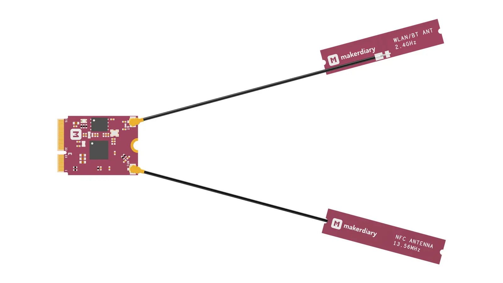

# Getting Started with the nRF52840 M.2 Module

## Introduction

This guide walks you through the setup and shows you how to run the Out of Box Demo without going through the complete toolchain installation. After following along with this section, you’ll be ready to start building your IoT projects.

## Requirements

* A [nRF52840 M.2 Developer Kit](https://store.makerdiary.com/products/nrf52840-m2-devkit) (including nRF52840 M.2 Module and M.2 Dock)
* A macOS, Linux or Windows computer

## Assemble the hardware

1. Make sure the M.2 Dock is powered off

2. Attach the provided 2.4GHz and NFC cabled PCB antennas to the nRF52840 M.2 module as shown in the figure below:

	

3. Insert the module into the connector as shown in the figure below:

	!!! Warning "Angle of Insertion"
		Angled insertion is allowable and preferred to minimize the insertion force. The angle of insertion is **5° ~ 25°**, **typically 20°**.
	
	

4. Secure the module using the provided mounting screw as shown in the figure below:

	

## Connect the board

Connect the **Module USB port** to your PC using the provided USB-C cable as shown in the figure below. A disk drive called **CIRCUITPY** should be automatically detected by the computer:

## Run Out-of-Box demo

Now you're ready to run our Out-of-Box demo application! This application is an endless runner game written in Python. You can find the source code of the game on GitHub: 

<a href="https://github.com/makerdiary/nrf52840-m2-devkit/tree/master/examples/python/dino"><button class="md-tile md-tile--primary" style="width:auto;"><svg xmlns="http://www.w3.org/2000/svg" viewBox="0 0 12 16" width="12" height="16"><path fill-rule="evenodd" d="M8.5 1H1c-.55 0-1 .45-1 1v12c0 .55.45 1 1 1h10c.55 0 1-.45 1-1V4.5L8.5 1zM11 14H1V2h7l3 3v9zM5 6.98L3.5 8.5 5 10l-.5 1L2 8.5 4.5 6l.5.98zM7.5 6L10 8.5 7.5 11l-.5-.98L8.5 8.5 7 7l.5-1z"></path></svg> examples/python/dino</button></a>

Just press the USER button to play the game:

## Next steps

To program the nRF52840 M.2 Module, check out this tutorial:

* [How to Program the nRF52840 M.2 Module](programming.md)

You can also refer to the [nRF52840 M.2 Developer Kit](https://wiki.makerdiary.com/nrf52840-m2-devkit) for the nRF52840 M.2 Module evaluation and development.

<a href="https://wiki.makerdiary.com/nrf52840-m2-devkit" target="_blank"><button class="md-tile md-tile--primary" style="width:auto;"><svg xmlns="http://www.w3.org/2000/svg" viewBox="0 0 16 16" width="16" height="16"><path fill-rule="evenodd" d="M12.17 3.83c-.27-.27-.47-.55-.63-.88-.16-.31-.27-.66-.34-1.02-.58.33-1.16.7-1.73 1.13-.58.44-1.14.94-1.69 1.48-.7.7-1.33 1.81-1.78 2.45H3L0 10h3l2-2c-.34.77-1.02 2.98-1 3l1 1c.02.02 2.23-.64 3-1l-2 2v3l3-3v-3c.64-.45 1.75-1.09 2.45-1.78.55-.55 1.05-1.13 1.47-1.7.44-.58.81-1.16 1.14-1.72-.36-.08-.7-.19-1.03-.34a3.39 3.39 0 01-.86-.63zM16 0s-.09.38-.3 1.06c-.2.7-.55 1.58-1.06 2.66-.7-.08-1.27-.33-1.66-.72-.39-.39-.63-.94-.7-1.64C13.36.84 14.23.48 14.92.28 15.62.08 16 0 16 0z"></path></svg> nRF52840 M.2 Developer Kit</button></a>

## Create an Issue

Interested in contributing to this project? Want to report a bug? Feel free to click here:

<a href="https://github.com/makerdiary/nrf52840-m2/issues/new?title=Getting%20Started:%20%3Ctitle%3E"><button class="md-tile md-tile--primary"><svg xmlns="http://www.w3.org/2000/svg" viewBox="0 0 14 16" width="14" height="16"><path fill-rule="evenodd" d="M7 2.3c3.14 0 5.7 2.56 5.7 5.7s-2.56 5.7-5.7 5.7A5.71 5.71 0 011.3 8c0-3.14 2.56-5.7 5.7-5.7zM7 1C3.14 1 0 4.14 0 8s3.14 7 7 7 7-3.14 7-7-3.14-7-7-7zm1 3H6v5h2V4zm0 6H6v2h2v-2z"></path></svg> Create an Issue</button></a>
