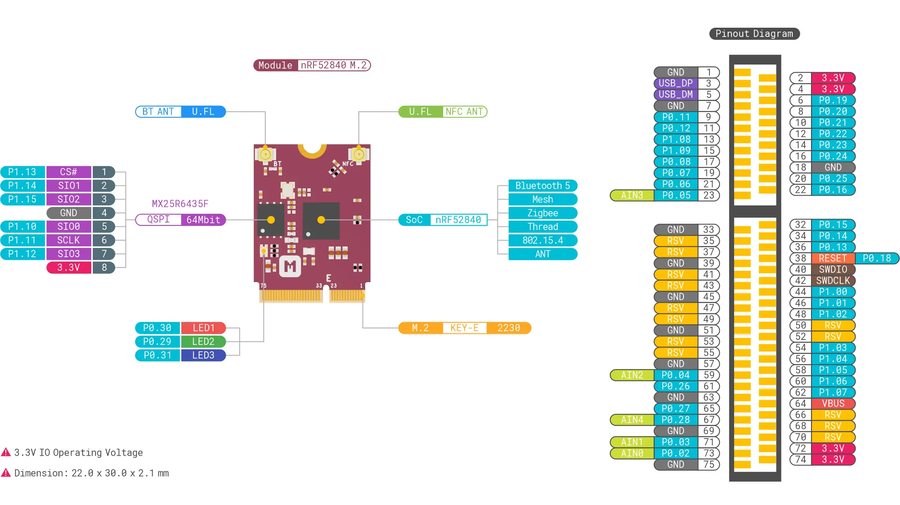

# nRF52840 M.2 Module <small>A removable M.2 module that enables multiprotocol connectivity, security and ease-of-use for your next embedded design</small>

## Description

**[nRF52840 M.2 Module](https://store.makerdiary.com/products/nrf52840-m2-module)** is a removable module designed and built to meet the multiprotocol connectivity, security and ease-of-use requirements of your next embedded design. Based on the nRF52840 SoC, it has protocol support for Bluetooth 5, Bluetooth mesh, Thread, Zigbee, 802.15.4, ANT and 2.4 GHz proprietary stacks.

The module comes with an M.2 (also known as NGFF - Next Generation Form Factor) Key-E form factor, that will simplify and minimize the development cycle and deployment of your end-product helping to accelerate its time-to-market.

We also offer the **[nRF52840 M.2 Developer Kit](https://store.makerdiary.com/products/nrf52840-m2-devkit)** to help you prototype your application and then scale to production faster using the nRF52840 M.2 Module combined with your custom PCB hardware.

## Key Features

* Nordic Semiconductor nRF52840 SoC
	- 64 MHz Arm® Cortex-M4 with FPU
	- 1 MB Flash + 256 KB RAM
	- Bluetooth 5, Bluetooth mesh, Thread, Zigbee, 802.15.4, ANT and 2.4 GHz proprietary
	- Arm TrustZone® Cryptocell 310 Security Subsystem
	- Integrated USB 2.0 Full-speed Controller
	- QSPI/SPI/TWI/I²S/PDM/QDEC/ADC support
	- Integrated NFC-A Tag

* Ultra low power 64Mbit QSPI flash memory
* User programmable RBG LED
* M.2 Key-E Form Factor
* U.FL/I-PEX MHF Antenna Connectors
* 2.4 GHz and NFC cabled PCB Antennas
* Dimensions: 22.00 x 30.00 x 2.1 mm

## Targeted Applications

* IoT Multi-Protocol Devices
* Lighting
* Connected Home
* Building Automation and Security
* Computer peripherals and I/O devices

## Hardware Diagram

The hardware diagram of the nRF52840 M.2 Module is shown below:

## Included in the Box

|    **Part**                | **Qty** |
| -------------------------- | ------- |
| nRF52840 M.2 Module        | 1       |
| 2.4 GHz Cabled PCB Antenna | 1       |
| NFC Cabled PCB Antenna     | 1       |

## Getting Started

The [nRF52840 M.2 Developer Kit](https://store.makerdiary.com/products/nrf52840-m2-devkit) is available for the nRF52840 M.2 Module evaluation and development.

<a href="https://store.makerdiary.com/products/nrf52840-m2-devkit" target="_blank"><button class="md-tile md-tile--primary" style="width:auto;"><svg xmlns="http://www.w3.org/2000/svg" viewBox="0 0 16 16" width="16" height="16"><path fill-rule="evenodd" d="M12.17 3.83c-.27-.27-.47-.55-.63-.88-.16-.31-.27-.66-.34-1.02-.58.33-1.16.7-1.73 1.13-.58.44-1.14.94-1.69 1.48-.7.7-1.33 1.81-1.78 2.45H3L0 10h3l2-2c-.34.77-1.02 2.98-1 3l1 1c.02.02 2.23-.64 3-1l-2 2v3l3-3v-3c.64-.45 1.75-1.09 2.45-1.78.55-.55 1.05-1.13 1.47-1.7.44-.58.81-1.16 1.14-1.72-.36-.08-.7-.19-1.03-.34a3.39 3.39 0 01-.86-.63zM16 0s-.09.38-.3 1.06c-.2.7-.55 1.58-1.06 2.66-.7-.08-1.27-.33-1.66-.72-.39-.39-.63-.94-.7-1.64C13.36.84 14.23.48 14.92.28 15.62.08 16 0 16 0z"></path></svg> nRF52840 M.2 Developer Kit</button></a>

## Design Resource

* [nRF52840 M.2 Module Hardware Diagram v1.0](resources/nrf52840_m2_module_diagram_v1_0.pdf)
* [nRF52840 M.2 Module Schematic V1.0](resources/nrf52840_m2_schematic_v1_0.pdf)
* [nRF52840 M.2 Module Board File V1.0](resources/nrf52840_m2_board_file_v1_0.pdf)
* [nRF52840 M.2 Module 3D Model V1.0](resources/nrf52840_m2_3d_model_v1_0.step)

## Create an Issue
Interested in contributing to this project? Want to report a bug? Feel free to click here:

<a href="https://github.com/makerdiary/nrf52840-m2/issues/new"><button class="md-tile md-tile--primary"><svg xmlns="http://www.w3.org/2000/svg" viewBox="0 0 14 16" width="14" height="16"><path fill-rule="evenodd" d="M7 2.3c3.14 0 5.7 2.56 5.7 5.7s-2.56 5.7-5.7 5.7A5.71 5.71 0 011.3 8c0-3.14 2.56-5.7 5.7-5.7zM7 1C3.14 1 0 4.14 0 8s3.14 7 7 7 7-3.14 7-7-3.14-7-7-7zm1 3H6v5h2V4zm0 6H6v2h2v-2z"></path></svg> Create an Issue</button></a>
